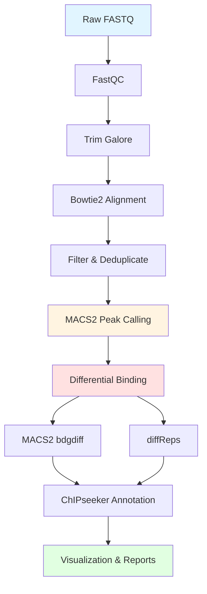

# ChIP-seq Analysis Pipeline: H4K8ac in Oligodendrocyte Progenitors

[](https://doi.org/10.1083/jcb.202308064)
[](https://www.ncbi.nlm.nih.gov/geo/query/acc.cgi?acc=GSE263808)

Complete ChIP-seq analysis pipeline from raw FASTQ to biological insights, analyzing H4K8ac chromatin occupancy in adult vs neonatal oligodendrocyte progenitor cells.

## 📊 Dataset

**Publication:** Dansu DK*, Selcen I*, et al. (2024). *Journal of Cell Biology* 223(11):e202308064  
**GEO Accession:** GSE263808  
**Cell Type:** PDGFRα+ oligodendrocyte progenitors  
**Comparison:** Adult (P60) vs Neonatal (P5) mice  
**Target:** Histone H4 Lysine 8 Acetylation (H4K8ac)  
**Replicates:** 3 biological replicates + matched Input controls  
**Platform:** Illumina HiSeq 4000 (paired-end, 150bp)

## 🚀 Quick Start

```bash
# Clone repository
git clone https://github.com/ipekselcen/chipseq-tutorial.git
cd chipseq-tutorial

# Set up environment
conda env create -f environment.yml
conda activate chipseq

# Download reference genome
bash scripts/00_setup_reference.sh

# Run complete pipeline
bash scripts/run_pipeline.sh
```

**Estimated runtime:** 8-10 hours on 8-core system

## 📁 Repository Structure

```
chipseq-tutorial/
├── README.md
├── environment.yml
├── data/
│   ├── raw/                    # FASTQ files (downloaded)
│   └── reference/              # mm10 genome & indices
├── scripts/
│   ├── 00_setup_reference.sh
│   ├── 01_download_data.sh
│   ├── 02_quality_control.sh
│   ├── 03_trim_adapters.sh
│   ├── 04_align_reads.sh
│   ├── 05_filter_bams.sh
│   ├── 06_call_peaks.sh
│   ├── 07_differential_macs2.sh
│   ├── 08_differential_diffreps.sh
│   ├── 09_annotation.R
│   ├── 10_visualization.R
│   └── run_pipeline.sh
└── results/
    ├── qc/                     # FastQC & MultiQC reports
    ├── trimmed/                # Trimmed reads
    ├── aligned/                # BAM files
    ├── peaks/                  # MACS2 peaks
    ├── differential/           # Differential binding
    ├── annotation/             # ChIPseeker results
    └── figures/                # All plots
```

## 🔬 Analysis Workflow



### Pipeline Steps

| Step | Script | Tool | Description |
|------|--------|------|-------------|
| 0 | `00_setup_reference.sh` | Custom | Download & index mm10 genome |
| 1 | `01_download_data.sh` | SRA Toolkit | Fetch FASTQ from GEO |
| 2 | `02_quality_control.sh` | FastQC, MultiQC | Quality assessment |
| 3 | `03_trim_adapters.sh` | Trim Galore | Adapter trimming |
| 4 | `04_align_reads.sh` | Bowtie2 | Read alignment |
| 5 | `05_filter_bams.sh` | SAMtools, Picard | Filter & deduplicate |
| 6 | `06_call_peaks.sh` | MACS2 | Peak calling |
| 7 | `07_differential_macs2.sh` | MACS2 bdgdiff | Differential peaks |
| 8 | `08_differential_diffreps.sh` | diffReps | Alternative differential |
| 9 | `09_annotation.R` | ChIPseeker | Genomic annotation |
| 10 | `10_visualization.R` | ggplot2, Gviz | Plots & figures |

## 🔑 Key Results

### Differential Binding Sites

**35,820 differential H4K8ac sites** (FDR < 0.01)
- **Adult-enriched:** 34,125 sites (95.3%)
- **Neonatal-enriched:** 1,695 sites (4.7%)

### Genomic Distribution

- **Promoters:** 43.2% (TSS ± 3kb)
- **Introns:** 34.2%
- **Intergenic:** 18.3%
- **Exons:** 4.3%

### Top Target Genes

| Gene | Function | Fold Change |
|------|----------|-------------|
| *Hes5* | Progenitor maintenance | +2.8 |
| *Gpr17* | OPC maturation | +2.5 |
| *Txnip* | Metabolic regulation | +2.3 |
| *Ptgds* | Lipid metabolism | +2.1 |
| *Cnp* | Myelin component | +1.9 |
| *Mog* | Myelin component | +1.7 |

## 🛠️ Installation

### Requirements

- **OS:** Linux or macOS
- **RAM:** ≥16GB (32GB recommended)
- **Storage:** ~50GB
- **CPU:** Multi-core recommended

### Dependencies

All dependencies managed via conda:

```bash
# Create environment
conda env create -f environment.yml
conda activate chipseq

# Verify installation
fastqc --version
bowtie2 --version
macs2 --version
Rscript -e "library(ChIPseeker)"
```

## 📖 Usage

### Option 1: Complete Pipeline

```bash
# Run everything
bash scripts/run_pipeline.sh
```

### Option 2: Step-by-Step

```bash
# Setup reference genome
bash scripts/00_setup_reference.sh

# Download data (requires SRA accessions)
bash scripts/01_download_data.sh

# Quality control
bash scripts/02_quality_control.sh

# Trim adapters
bash scripts/03_trim_adapters.sh

# Align to genome
bash scripts/04_align_reads.sh

# Filter BAMs
bash scripts/05_filter_bams.sh

# Call peaks
bash scripts/06_call_peaks.sh

# Differential binding (MACS2)
bash scripts/07_differential_macs2.sh

# Differential binding (diffReps)
bash scripts/08_differential_diffreps.sh

# Annotate peaks
Rscript scripts/09_annotation.R

# Visualize results
Rscript scripts/10_visualization.R
```

### Option 3: Test Mode

```bash
# Quick test with subset
bash scripts/run_pipeline.sh --test
```

## 📊 Output Files

### Peak Files

```
results/peaks/
├── nOPC_rep1_peaks.narrowPeak
├── nOPC_rep1_peaks.xls
├── nOPC_rep1_summits.bed
├── aOPC_rep1_peaks.narrowPeak
└── ...
```

### Differential Binding

```
results/differential/
├── macs2/
│   ├── adult_vs_neonatal_c3.0_cond1.bed
│   ├── adult_vs_neonatal_c3.0_cond2.bed
│   └── adult_vs_neonatal_c3.0_common.bed
└── diffreps/
    ├── adult_vs_neonatal.txt
    ├── adult_enriched.bed
    └── neonatal_enriched.bed
```

### Annotation

```
results/annotation/
├── peak_annotation.csv
├── functional_enrichment_GO.csv
├── functional_enrichment_KEGG.csv
└── gene_lists/
    ├── adult_enriched_genes.txt
    └── neonatal_enriched_genes.txt
```

### Figures

```
results/figures/
├── qc_summary.pdf
├── peak_annotation_pie.pdf
├── peak_distribution_barplot.pdf
├── differential_venn.pdf
├── GO_enrichment_dotplot.pdf
├── genome_tracks_Hes5.pdf
└── heatmap_differential.pdf
```

## 🧬 Biological Insights

### Adult OPC Chromatin Landscape

H4K8ac enrichment in adult OPCs reflects:

1. **Maintained progenitor identity** - *Hes5*, *Sox9*, *Olig2*
2. **Enhanced metabolism** - *Txnip*, *Ptgds*, mitochondrial genes
3. **Myelin gene priming** - *Cnp*, *Mog*, *Mbp*

### Functional Implications

- **Lower proliferation:** Cell cycle genes lack H4K8ac
- **Metabolic adaptation:** Lipid metabolism genes enriched
- **Differentiation readiness:** Myelin genes accessible

## 🔍 Quality Control

### Expected QC Metrics

| Metric | Threshold | Expected |
|--------|-----------|----------|
| Read quality (Q30) | >80% | 85-95% |
| Mapping rate | >70% | 80-90% |
| Duplicate rate | <30% | 15-25% |
| NSC | >1.05 | 1.2-1.5 |
| RSC | >0.8 | 0.9-1.2 |
| FRiP | >1% | 3-8% |

### Sample QC Checklist

- [ ] FastQC shows good quality (Q>30)
- [ ] No adapter contamination
- [ ] High mapping rate (>80%)
- [ ] Low duplication (<25%)
- [ ] Clear enrichment in fingerprint plot
- [ ] Sufficient peak calls (>10,000)

## 📚 Methods & Tools

### Peak Calling

**MACS2 (v2.2.7+)**
```bash
macs2 callpeak \
  -t ChIP.bam \
  -c Input.bam \
  -f BAMPE \
  -g mm \
  --broad \
  --broad-cutoff 0.01 \
  --outdir peaks/
```

### Differential Binding

**Method 1: MACS2 bdgdiff**
- Compares bedGraph signals
- FDR correction
- Identifies condition-specific peaks

**Method 2: diffReps**
- Window-based approach
- Negative binomial test
- Robust to library size differences

### Annotation

**ChIPseeker**
- TSS-centric annotation
- Genomic feature distribution
- Functional enrichment (GO, KEGG)

## 🎓 Tutorial

Detailed walkthrough available in [TUTORIAL.md](TUTORIAL.md)

Topics covered:
- Understanding ChIP-seq data
- Peak calling strategies
- Differential binding analysis
- Biological interpretation
- Integration with RNA-seq
- Publication-quality figures

## 📄 Citation

```bibtex
@article{dansu2024histone,
  title={Histone H4 acetylation differentially modulates proliferation in adult oligodendrocyte progenitors},
  author={Dansu, David K and Selcen, Ipek and Sauma, Sami and Prentice, Emily and Huang, Dennis and Li, Meng and Moyon, Sarah and Casaccia, Patrizia},
  journal={Journal of Cell Biology},
  volume={223},
  number={11},
  pages={e202308064},
  year={2024},
  doi={10.1083/jcb.202308064}
}
```

## 🤝 Contributing

Contributions welcome! Please:
1. Fork the repository
2. Create a feature branch
3. Submit a pull request

## 📧 Contact

**Ipek Selcen, PhD**  
- Website: [ipekselcen.github.io](https://ipekselcen.github.io)
- GitHub: [@ipekselcen](https://github.com/ipekselcen)

## 🙏 Acknowledgments

- CUNY Advanced Science Research Center
- Dr. Patrizia Casaccia (PI)
- David Dansu (co-first author)
- All co-authors and collaborators

## 🔗 Resources

- [ENCODE ChIP-seq Guidelines](https://www.encodeproject.org/chip-seq/)
- [MACS2 Documentation](https://github.com/macs3-project/MACS)
- [diffReps Documentation](https://github.com/shenlab-sinai/diffreps)
- [ChIPseeker Vignette](https://bioconductor.org/packages/ChIPseeker)
- [GEO Dataset GSE263808](https://www.ncbi.nlm.nih.gov/geo/query/acc.cgi?acc=GSE263808)

---

⭐ **Star this repo if you find it useful!**
